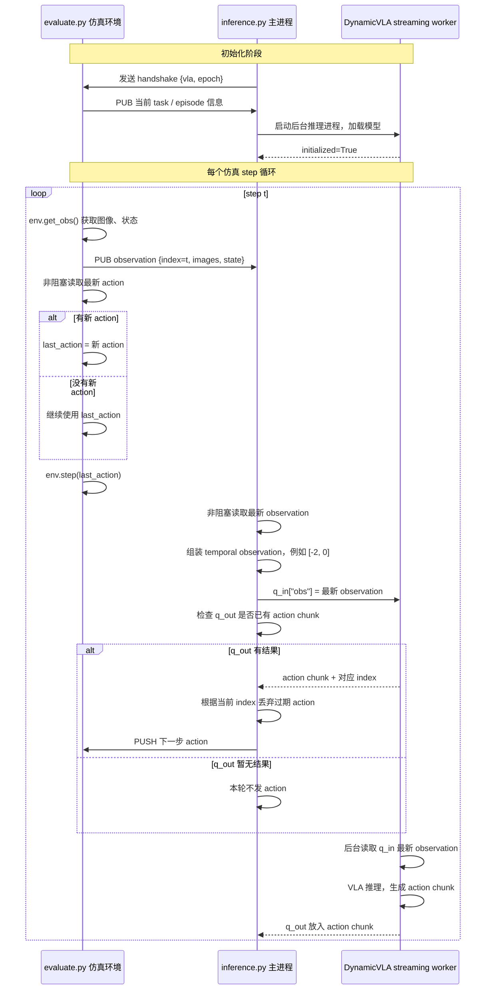

```mermaid
sequenceDiagram
    participant Sim as evaluate.py 仿真环境
    participant Client as inference.py 主进程
    participant Worker as DynamicVLA streaming worker

    Note over Sim,Worker: 初始化阶段
    Client->>Sim: 发送 handshake {vla, epoch}
    Sim->>Client: PUB 当前 task / episode 信息
    Client->>Worker: 启动后台推理进程，加载模型
    Worker-->>Client: initialized=True

    Note over Sim,Worker: 每个仿真 step 循环

    loop step t
        Sim->>Sim: env.get_obs() 获取图像、状态
        Sim->>Client: PUB observation {index=t, images, state}

        Sim->>Sim: 非阻塞读取最新 action
        alt 有新 action
            Sim->>Sim: last_action = 新 action
        else 没有新 action
            Sim->>Sim: 继续使用 last_action
        end

        Sim->>Sim: env.step(last_action)

        Client->>Client: 非阻塞读取最新 observation
        Client->>Client: 组装 temporal observation，例如 [-2, 0]

        Client->>Worker: q_in["obs"] = 最新 observation
        Client->>Client: 检查 q_out 是否已有 action chunk

        alt q_out 有结果
            Worker-->>Client: action chunk + 对应 index
            Client->>Client: 根据当前 index 丢弃过期 action
            Client->>Sim: PUSH 下一步 action
        else q_out 暂无结果
            Client->>Client: 本轮不发 action
        end

        Worker->>Worker: 后台读取 q_in 最新 observation
        Worker->>Worker: VLA 推理，生成 action chunk
        Worker-->>Client: q_out 放入 action chunk
    end
```